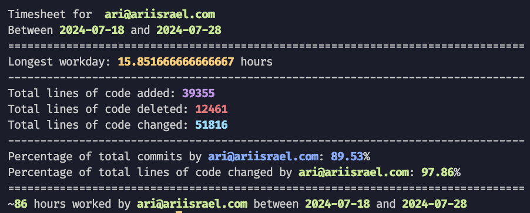

# Timesheet

This script fetches commits from a specified GitHub repository and analyzes workdays based on commit activity. It calculates the total hours worked each day and within a specified date range.



## Prerequisites

- Node.js (v20 or later)
- npm
- A GitHub personal access token

## Setup

1. **Clone the repository**:
   ```sh
   git clone https://github.com/ariisrael/timesheet.git
   cd timesheet
   ```

2. **Install dependencies**:
   ```sh
   npm install
   ```

3. **Create a `.env` file** in the root of the project:
   ```sh
   touch .env
   ```

4. **Open the `.env` file** and add the following environment variables**:
   ```env
   GITHUB_OWNER=gosabo
   GITHUB_REPO=web
   GITHUB_USER_EMAIL=github_email_for_timesheet_user@example.com
   GITHUB_TOKEN=your_personal_access_token
   START_DATE=2024-07-19
   END_DATE=null # null means today, or specify a date like 2024-07-20
   TIME_BETWEEN_COMMITS=10 # hours between commits to consider a new work day
   ```

   Replace `your_personal_access_token` and `your_github_email@example.com` with your actual GitHub personal access token and GitHub email.

5. **Add `.env` to `.gitignore`** to ensure it is not committed to version control:
   ```sh
   echo ".env" >> .gitignore
   ```

## Running the Script

To run the script and analyze the commits:

```sh
npm start
```

## Environment Variables

- `GITHUB_OWNER`: The GitHub username or organization that owns the repository.
- `GITHUB_REPO`: The name of the repository.
- `GITHUB_TOKEN`: Your GitHub personal access token. You can generate this token from your GitHub account settings under `Developer settings` > `Personal access tokens`.
- `GITHUB_USER_EMAIL`: The GitHub email of the user for whom you are generating a timesheet
- `START_DATE`: The start date for the analysis (e.g., `2024-07-19`).
- `END_DATE`: The end date for the analysis (e.g., `2024-07-20`). Use `null` for today.
- `TIME_BETWEEN_COMMITS`: The number of hours between commits to consider a new workday (default: 10).

## Generating a GitHub Personal Access Token

1. **Go to GitHub**: Log in to your GitHub account and navigate to `Settings`.
2. **Developer settings**: Scroll down to `Developer settings`.
3. **Personal access tokens**: Click on `Personal access tokens`.
4. **Generate new token**: Click the `Generate new token` button.
5. **Set token scopes**: Select the scopes for the token. For reading repository data, you typically need the `repo` scope.
6. **Generate token**: Click `Generate token`.
7. **Copy the token**: Make sure to copy the token immediately, as you won't be able to see it again.

## Notes

- Ensure your `.env` file is correctly configured with your GitHub credentials.
- The script calculates workdays based on the time between commits. If the time between commits exceeds a specified number of hours (default: 10), it is considered a new workday.
- Modify the `START_DATE` and `END_DATE` constants in the script to specify the date range for analysis.

## License

This project is licensed under the MIT License.
